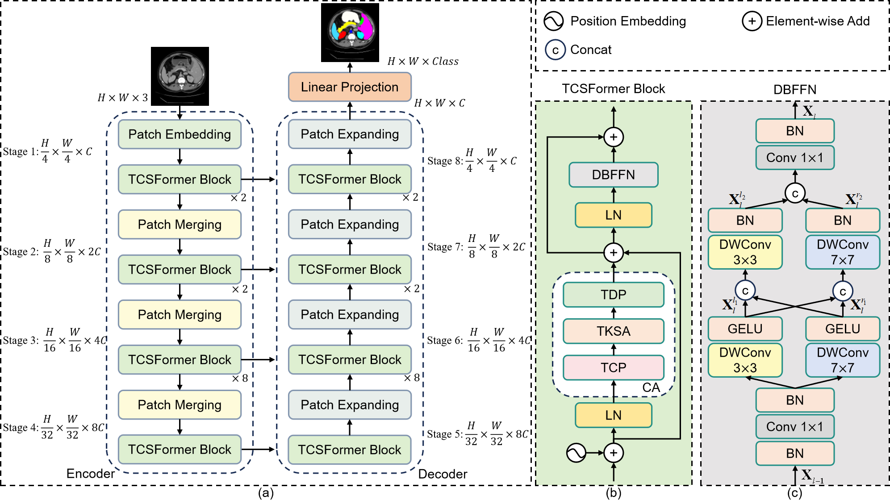
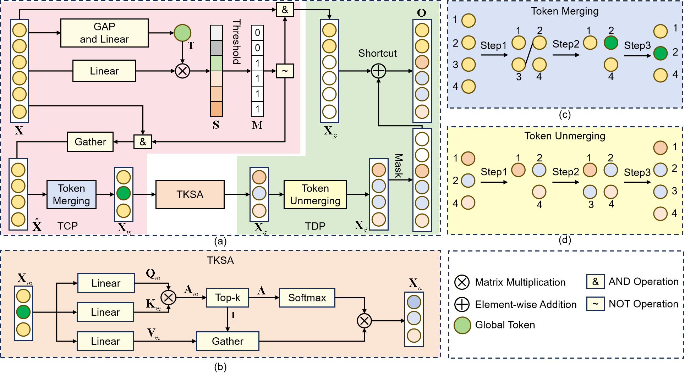

# TCSAFormer: Efficient Vision Transformer with Token Compression and Sparse Attention for Medical Image Segmentation
Zunhui Xia, Hongxing Li, Libin Lan

## Performance comparison of different medical image segmentation models：

## TCSAFormer Architecture:

## The overall architecture of CA:

